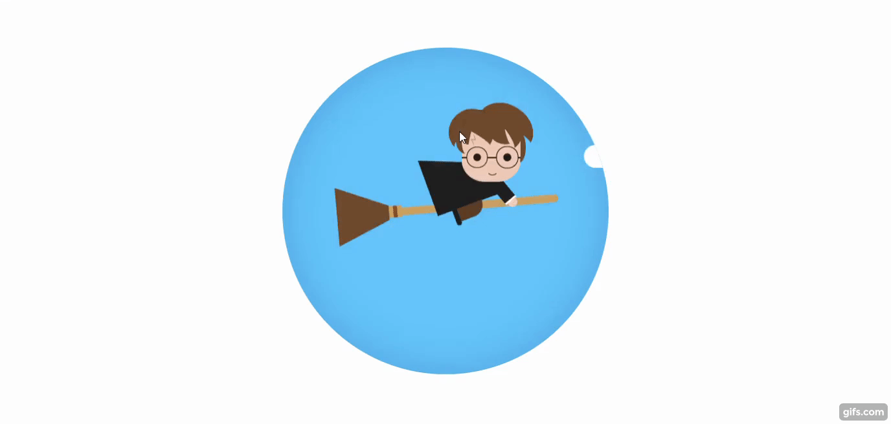

<div align="center">
    <h1 align="center">Creating Harry Potter animation 🧙‍♂️ </h1>
    <p>Criação de uma animação com o tema do Harry potter.</p>
    
</div>

---

<h3 align="center">
  <a href="https://harry-potter-animation.vercel.app/">Acessar demonstração</a>
</h3>

## Índice

- [Descrição](#descrição)
- [Techs](#techs)
- [Design](#design)
  - [Cores](#cores)
  - [Tipo de fonte](#tipo-de-fonte)
  - [Pacote de ícones](#pacote-de-ícones)
- [Instalação](#instalação)
- [Links Contato](#links-contato)

# Descrição

Criação de uma animação com o tema do Harry potter. [**@Code Artist**](https://www.youtube.com/c/CodingArtist)

# Techs:

- **HTML**
- **CSS**

# Design:

- O modelo final para desktop está disponível na pasta `./design`
- Imagens disponíveis na pasta `./assets`<br>


# Instalação:

```bash
  # Clone este repositório:
  $ git clone https://github.com/GabrielChagas1/harry-potter-animation.git
  $ cd ./harry-potter-animation
```

# Links Contato

- **Linkedin:** https://www.linkedin.com/in/gabriel-serqueira-chagas/<br>
- **GitHub:** https://github.com/GabrielChagas1<br>
